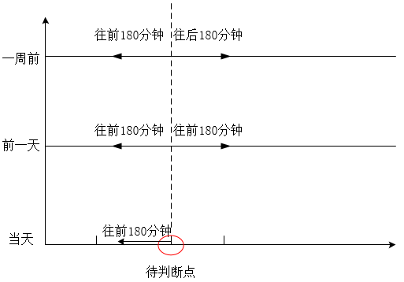
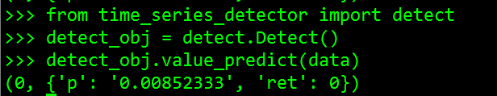
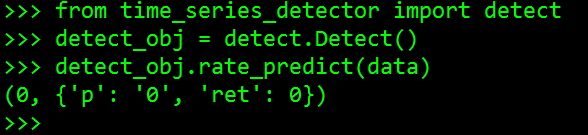

# API接口文档
## 时间序列异常检测接口

用户可根据场景选择使用API接口对时间序列进行异常检测：

1、量值检测：适用于大多数KPI指标数据的检测，使用无监督和有监督联合检测，会加载检测模型

2、率值检测：适用于正态分布类型数据的检测，使用无监督算法进行检测，如成功率等生死指标数据的检测

-HTTP interface call, please use the built back -end service address; Python interface can be directly called
-The current detection time window is selected for 3 hours, 1 data point per minute, that is, the window value is 180
-The selection of data date and time period can be adjusted according to the actual situation. The two data in the document take the year -on -year year -on -year year -on -year data.

针对当前一个值的检测，需要依赖过去三段数据，数据选取规则参考示例图：


### 1. HTTP interface

#### 1, quantity detection

* API: Post /{IP}: {Port} /PredictValue
* Function description: Check whether the latest data point is abnormal according to the reference data
* Request parameter request:
---
```
{{
    "Viewid": "2012",
    "ViewName": "Login function",
    "Attrid": "19201",
    "Attrname": "Ptlogin login request total amount",
    "taskid": "1530608070706",
    "Window": 180,
    "time": "2018-10-17 17:28:00",
    "DataC": "9,10,152, ..., 255, ..., 16",
    "datab": "9,10,152, ..., 255, ..., 18",
    "Dataa": "9,10,152, ..., 458"
}
```
---

* Request field description:

| Name | Type | Must -Fill | Default value | Description |
| --- | --- | --- | ---- | --- |
| Viewid | String | Yes | No | Index Collection ID |
| ViewName | String | Yes | No | Index Collection Name |
| Attrid | String | Yes | No | Index ID |
| Attrname | String | Yes | No | Index Name |
| Taskid | String | No | No | The detection model used, if not passed, use the system default model |
| Window | int | Yes | No | Window value, currently supports 180 |
| Time | String | Yes | Yes | No | The time identification of the detection point, that is, the last point of the dataa, format: "yyyy-mm-dd HH: SS" | |
| DataC | String | Yes | No | 1 point to be tested corresponds to the point of the same time a week ago + 180 data before and after, 361 data points are stitched in the order of time, the English community is separated |
| datab | String | Yes | No | 1 point to be tested corresponds to the point of the same time yesterday + 180 data before and after, 361 data points are stitched in order of time, English comma separation |
| Dataa | String | Yes | No | 1 point to be tested+180 data, a total of 181 data points, 181 data points stitching in the order of time, English community separation |


* Details parameter Response:
---
```
{{
    "code": 0,
    "MSG": "Successful operation",
    "Data":
    {{
        "RET": 0,
        "P": "0.05",
    }
}
```
---

* Response field description:

| Name | Type | Description |
| --- | --- | --- | |
| code | int | Return code.0: Success; Fei 0: Failure |
| msg | string | Return message |
| RET | int | The test results are abnormal.0: Abnormal; 1: Normal |
| P | String | Probability value, the smaller the value, the higher the determination of the decision as abnormal. At present, P <0.15, the judgment is abnormal |

#### 2. Rate value detection

* API: Post /{IP}: {Port} /Predictrate
* Function description: Check whether the latest data point is abnormal according to the reference data
* Request parameter request:
---
```
{{
    "Viewid": "2012",
    "ViewName": "Login function",
    "Attrid": "19201",
    "Attrname": "Ptlogin login success rate",
    "Window": 180,
    "time": "2018-10-17 17:28:00",
    "DataC": "100,99.8,100, ..., 100, ..., 100",
    "datab": "99.5,100,100, ..., 99.6, ..., 100",
    "Dataa": "100,98.5,100, ..., 85.9"
}
```
---

* request字段说明：

| Name | Type | Must -Fill | Default value | Description |
| --- | --- | --- | --- | --- |
| Viewid | String | Yes | No | Index Collection ID |
| ViewName | String | Yes | No | Index Collection Name |
| Attrid | String | Yes | No | Index ID |
| Attrname | String | Yes | No | Index Name |
| Window | int | Yes | No | Window value, currently supports 180 |
| Time | String | Yes | Yes | No | The time identification of the detection point, that is, the last point of the dataa, format: "yyyy-mm-dd HH: SS" | |
| DataC | String | Yes | No | 1 point to be tested corresponds to the point of the same time a week ago + 180 data before and after, 361 data points are stitched in the order of time, the English community is separated |
| datab | String | Yes | No | 1 point to be tested corresponds to the point of the same time yesterday + 180 data before and after, 361 data points are stitched in order of time, English comma separation |
| Dataa | String | Yes | No | 1 point to be tested+180 data, a total of 181 data points, 181 data points stitching in the order of time, English community separation |


* Details parameter Response:

---
```
{{
    "code": 0,
    "MSG": "Successful operation",
    "Data":
    {{
        "RET": 0,
        "P": "0",
    }
}
```
---

* Response field description:

| Name | Type | Description |
| --- | --- | --- | |
| code | int | Return code.0: Success; Fei 0: Failure |
| msg | string | Return message |
| RET | int | The test results are abnormal.0: Abnormal; 1: Normal |
| P | String | Probability value, the smaller the value.

### 二、Python API

Time_series_detector directory in the metis engineering directory is the time series abnormal detection and academic parliament, which can be directly called in the Python code

#### 1, quantity detection
* Function description: Check whether the latest data point is abnormal according to the reference data

* Calling method:

---
```
# Python
from time_series_detector import detect

detect_obj = detect.Detect()
detect_obj.value_predict(data)
```
---


* Pass parameter: python dictionary
---
```
{
    "window":180,
    "dataC":"9,10,152,...,255,...,16",
    "dataB":"9,10,152,...,255,...,18",
    "dataA":"9,10,152,...,458"
}
```
---

* Pass parameter description:

| Name | Type | Must -Fill | Default value | Description |
| --- | --- | --- | ---- | --- |
| Taskid | String | No | No | The detection model used, if not passed, use the system default model |
| Window | int | No | No | No | Window value, currently supports 180 |
| DataC | String | Yes | No | 1 point to be tested corresponds to the point of the same time a week ago + 180 data before and after, 361 data points are stitched in the order of time, the English community is separated |
| datab | String | Yes | No | 1 point to be tested corresponds to the point of the same time yesterday + 180 data before and after, 361 data points are stitched in order of time, English comma separation |
| Dataa | String | Yes | No | 1 point to be tested+180 data, a total of 181 data points, 181 data points stitching in the order of time, English community separation |


* Return to parameters:
---
```
    code, {
        "ret":0,
        "p":"0.05",
    }

```
---

* Return to parameter description:

| Name | Type | Description |
| --- | --- | --- | |
| code | int | Return code.0: Success; Fei 0: Failure |
| RET | int | The test results are abnormal.0: Abnormal; 1: Normal |
| P | String | Probability value, the smaller the value, the higher the determination of the decision as abnormal. At present, P <0.15, the judgment is abnormal |

* Call the case:



#### 2. Rate value detection
* Function description: Check whether the latest data point is abnormal according to the reference data

* Calling method:

---
```
# Python
from time_series_detector import detect

detect_obj = detect.Detect()
detect_obj.rate_predict(data)
```
---

* Pass parameter: python dictionary
---
```
{
    "dataC":"9,10,152,...,255,...,16",
    "dataB":"9,10,152,...,255,...,18",
    "dataA":"9,10,152,...,458"
}
```
---

* Pass parameter description:

| Name | Type | Must -Fill | Default value | Description |
| --- | --- | --- | --- | --- |
| DataC | String | Yes | No | 1 point to be tested corresponds to the point of the same time a week ago + 180 data before and after, 361 data points are stitched in the order of time, the English community is separated |
| datab | String | Yes | No | 1 point to be tested corresponds to the point of the same time yesterday + 180 data before and after, 361 data points are stitched in order of time, English comma separation |
| Dataa | String | Yes | No | 1 point to be tested+180 data, a total of 181 data points, 181 data points stitching in the order of time, English community separation |


* Return to parameters:
---
```
    code, {
        "ret":0,
        "p":"0",
    }

```
---

* Return to parameter description:

| Name | Type | Description |
| --- | --- | --- | |
| code | int | Return code.0: Success; Fei 0: Failure |
| RET | int | The test results are abnormal.0: Abnormal; 1: Normal |
| P | String | Probability value, the smaller the value, the higher the determination of the decision as abnormal. At present, P <0.15, the judgment is abnormal |

* Call the case:



### 3, lib library
Time_Series_detector/lib is the academic dynamic library directory in the metis project directory. The library file can be loaded in the code

libdetect.so is currently supporting use in CentOS7.2+system environment


#### python code call:

##### 1, quantity detection
* Function description: Check whether the latest data point is abnormal according to the reference data

* Calling method:

Load the so library:
---
```
# Python
so = cdll.LoadLibrary
metis_lib = so("./libdetect.so")
handle = metis_lib.load_model("./xgb_default_model")
```
---

Construction data:
---
```
# Python
from ctypes import *

class ValueData(Structure):
    _fields_ = [('data_a', POINTER(c_int)), ('data_b', POINTER(c_int)), ('data_c', POINTER(c_int)),
                ('len_a', c_int), ('len_b', c_int), ('len_c', c_int)]

# test data
data_c = [1] * 361
data_b = [1] * 361
data_a = [1] * 180
data_a.append(10)

paarray = (c_int * len(data_a))(*data_a)
pbarray = (c_int * len(data_b))(*data_b)
pcarray = (c_int * len(data_c))(*data_c)
data_value = ValueData(paarray, pbarray, pcarray, len(data_a), len(data_b), len(data_c))  
```
---

Calculate the calculation function:

---
```
#python
result = c_int()
prob = c_float()
ret_code = metis_lib.value_predict(handle, byref(data_value), byref(result), byref(prob))
if ret_code != 0:
    print "value_predict error code = %d" % ret_code
print result, prob
```
---


* Pass parameter: C structure
---
```
typedef struct {
    int* data_a;
    int* data_b;
    int* data_c;
    int len_a;
    int len_b;
    int len_c;
} ValueData;
```
---
* Pass parameter description:

| Name | Type | Must -Fill | Default value | Description |
| --- | --- | --- | ---- | --- |
| handle | int | Yes | No | Model handle, return by load_model |
| Data_value | ValueData | Yes | No | No to detect data |


* Return to parameters:
---
```
ret_code
result
prob
```
---

* Return to parameter description:

| Name | Type | Description |
| --- | --- | --- | |
| RET_CODE | int | Return code.0: Success; Fei 0: Failure |
| Result | c_int | The detection results are abnormal.0: Abnormal; 1: Normal |
| Prob | C_Float | Probability value, the smaller the value, the higher the confidence of the judgment as an abnormality. At present, Prob <0.15, the judgment is abnormal |

##### 2. Rate value detection
* Function description: Check whether the latest data point is abnormal according to the reference data

* Calling method:

Load the so library:
---
```
# Python
so = cdll.LoadLibrary
metis_lib = so("./libdetect.so")
```
---

Construction data:
---
```
# Python
from ctypes import *

class RateData(Structure):
_fields_ = [('data_a', POINTER(c_double)), ('data_b', POINTER(c_double)), ('data_c', POINTER(c_double)),
            ('len_a', c_int), ('len_b', c_int), ('len_c', c_int)]

# test data
data_c = [1.0] * 361
data_b = [1.0] * 361
data_a = [1.0] * 180
data_a.append(0.9)

paarray = (c_double * len(data_a))(*data_a)
pbarray = (c_double * len(data_b))(*data_b)
pcarray = (c_double * len(data_c))(*data_c)
data_value = RateData(paarray, pbarray, pcarray, len(data_a), len(data_b), len(data_c))
```
---

Calculate the calculation function:

---
```
#python
result = c_int()
prob = c_float()
ret_code = metis_lib.rate_predict(byref(data_value), byref(result), byref(prob))
if ret_code != 0:
    print "value_predict error code = %d" % ret_code
print result, prob
```
---


* Pass parameter: C structure
---
```
typedef struct {
    double* data_a;
    double* data_b;
    double* data_c;
    int len_a;
    int len_b;
    int len_c;
} RateData;
```
---
* Pass parameter description:

| Name | Type | Must -Fill | Default value | Description |
| --- | --- | --- | ---- | --- |
| Data_value | Ratedata | Yes | No | To detect data |


* Return to parameters:
---
```
 ret_code
 result
 prob
```
---

* Return to parameter description:

| Name | Type | Description |
| --- | --- | --- | |
| RET_CODE | int | Return code.0: Success; Fei 0: Failure |
| Result | c_int | The detection results are abnormal.0: Abnormal; 1: Normal |
| PROB | C_Float | Probability value, the smaller the value, the higher the confidence of the determination of abnormalities |

#### c code call:

Call the detection function in C, you need the INCLUDE header file detect.h to link libdetect.so file when compiling
##### 1, quantity detection
* Function description: Check whether the latest data point is abnormal according to the reference data

* Calling method:

Call the load_model loading model, and then call Value_predict for prediction:


---
```
 #include "detect.h"
 
 if (NULL == (handle = load_model("./xgb_default_model")))
 {
     printf("load model error\n");
     return 0;
 }
 int ret = value_predict(handle, &value_data, &sample_result, &prob); 
 printf ("ret=%d result = %d prob = %f\n", ret, sample_result, prob); 
```
---
* Pass parameter: C structure
---
```
typedef struct {
    int* data_a;
    int* data_b;
    int* data_c;
    int len_a;
    int len_b;
    int len_c;
} ValueData;
```
---
* Pass parameter description:

| Name | Type | Must -Fill | Default value | Description |
| --- | --- | --- | ---- | --- |
| handle | int | Yes | No | Model handle, return by load_model |
| Value_data | Valuedata | Yes | No | No to detect data |


* Return to parameters:
---
```
ret
sample_result
prob
```
---

* Return to parameter description:

| Name | Type | Description |
| --- | --- | --- | |
| RET | int | Return code.0: Success; Fei 0: Failure |
| sample_result | c_int | The detection results are abnormal.0: Abnormal; 1: Normal |
| Prob | C_Float | Probability value, the smaller the value, the higher the confidence of the judgment as an abnormality. At present, Prob <0.15, the judgment is abnormal |

##### 2. Rate value detection
* Function description: Check whether the latest data point is abnormal according to the reference data

* Calling method:

---
```
#include "detect.h"
float prob;
int sample_result;
int ret = rate_predict(&rate_data, &sample_result, &prob);
printf ("ret=%d result =%d prob = %f \n", ret, sample_result, prob);
```
---


* Pass parameter: C structure
---
```
typedef struct {
    double* data_a;
    double* data_b;
    double* data_c;
    int len_a;
    int len_b;
    int len_c;
} RateData;
```
---
* Pass parameter description:

| Name | Type | Must -Fill | Default value | Description |
| --- | --- | --- | ---- | --- |
| Rate_data | Ratedata | Yes | No | To detect data |


* Return to parameters:
---
```
ret
sampleResult
prob
```
---

* Return to parameter description:

| Name | Type | Description |
| --- | --- | --- | |
| RET | int | Return code.0: Success; Fei 0: Failure |
| Result | c_int | The detection results are abnormal.0: Abnormal; 1: Normal |
| PROB | C_Float | Probability value, the smaller the value, the higher the confidence of the determination of abnormalities |