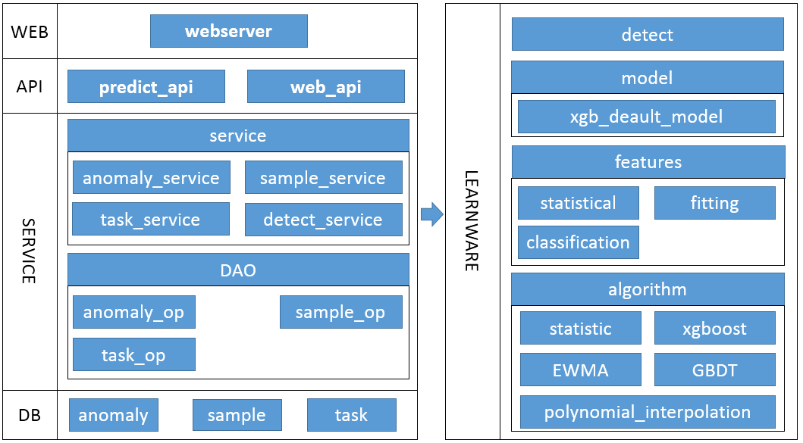

## The architecture of Time Sequence abnormal testing

 

The overall layer of the time sequence abnormal detection project can be divided into the following five layers:

1. ** Data layer (DB) **: Storage detection exception information, sample information, task information, etc.

2. ** service layer (service) **: service layer is divided into two major modules

1. ** Data Drive Module DAO **: The data operation interface with the DB layer is encapsulated.
    
    2. ** Business module Service **: Complete the specific business logic of the API layer.

3. ** Learnware **: The academic layer is divided into three major modules
  
   1. ** Detection Module DETECT **: Provide time sequence abnormal detection interface
    
   2. ** Feature calculation module Features **: Provides the characteristics of three types of time sequences (statistical features, fittings, classification features) for feature extraction of timing data, and use in supervision learning and training.

3. ** Algorithm module Algorithm **: Provide several common machine learning algorithm packaging (statistical discrimination algorithm, index moving average algorithm, polynomial algorithm, GBDT and XGBOOST, etc.) to jointly arbitral testing of order data.
    
4. ** interface layer (API) **: Provide API capabilities, time sequence abnormal detection interface and web management operating interface.

5. ** Web layer (web) **: The web service provided by the system can perform operations such as abnormal queries, marking marking, sample library management, model training and other operations through the service interface.