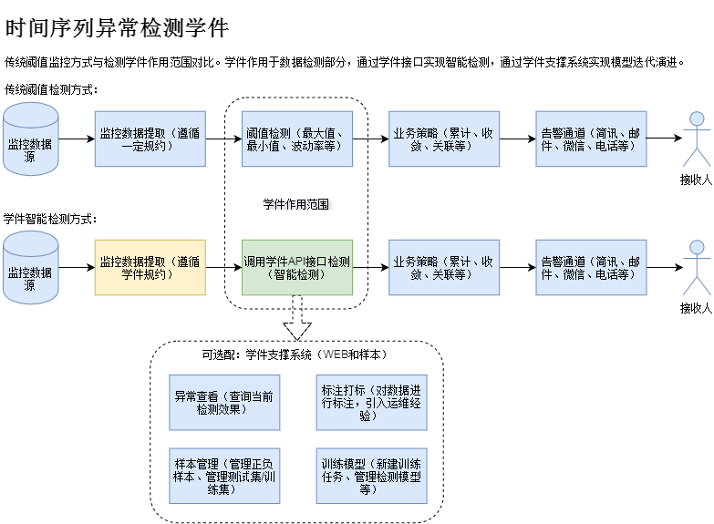

## 件 学
The term "Learnware" is originally created by Teacher Zhou Zhihua, Nanjing University.
Many people may have established similar models in their own applications, and they are also willing to find a place to share these models.In this way, a new user wants to apply it, maybe you do n’t have to build one by yourself, but first go to the “academic” market to find a suitable one, and use it directly or modify it.Studying is based on experts, so it is easier to get the results of the expert level. Because of the shared model, the problem of data leakage and privacy leakage is avoided.

### 维 维 维 维 维#
"Operation and Maintenance Process" is also known as AI operation and maintenance components. APIs or public libraries similar to programs, but API and public libraries do not include specific business data, just some algorithm or logic, and AI operation and maintenance components areSimilar to API, the "memory" capabilities that are both intelligent solutions to a certain Yunwei scenarios have preserved the intelligent rules that handle this scene in this component.
This intelligent rule is learned from a certain amount of data, and has the characteristics of "reusable", "evolution", and "understandable".And privacy.

## Application Case Scene

Time sequence abnormal detection academic permit has been polished by massive monitoring data, and is widely used in the field of abnormal detection and operation and maintenance monitoring alarm.

### Functiontional characteristics

Time sequence abnormal testing:ce abnormal testing:

* Abnormal detection API: Provide rate detection and quantity detection API interface, test the time sequence

Time sequence abnormal detection academic support system:

* Extracting features: Provide the extraction function of three types of characteristics (statistical features, fittings, and classification features), feature dimensions 90+; support to increase custom features
* Abnormal query: The time sequence (only abnormal) after the API detection (only abnormal) is stored in storage, providing management functions, paging query, retraction, shrinking, etc.
* Label labeling: Provide the function of labeling, mark/cancel the label as positive and negative sample, and automatically transfer the sample library after the marker
* Sample management: Provide functions of sample management functions, retrieval, map, edit, delete, import and other functions
* Model management: Provide model management functions, support custom model training

### Application data scenario

* Operating system data: Suitable for basic monitoring data at the level of operating system, such as CPU, memory, disk, traffic, package volume, etc.
* Application data: It is suitable for detecting the timing data recorded in the operation of the application, such as reading and writing, calls, and custom monitoring indicators.
* KPI index data: suitable for detecting KPI data, such as transaction volume, income value, online number, success rate, failure and other key indicators.

