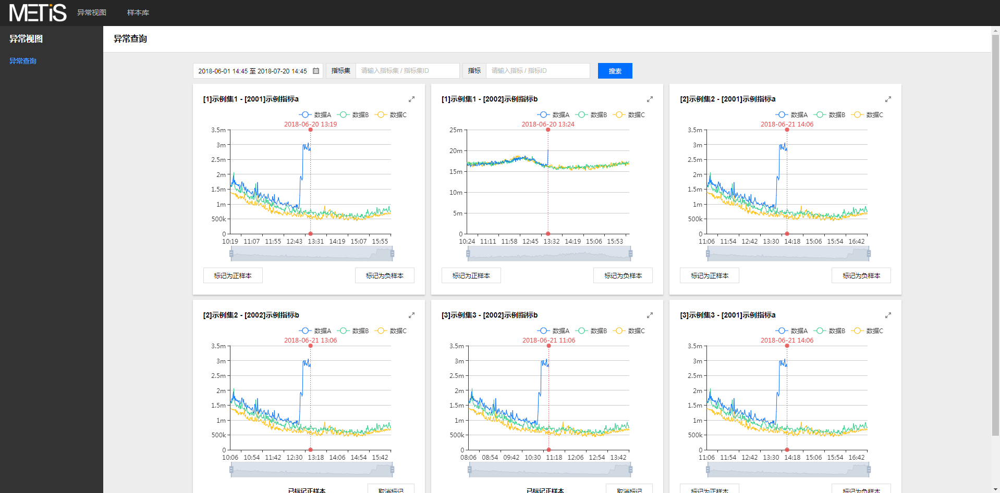
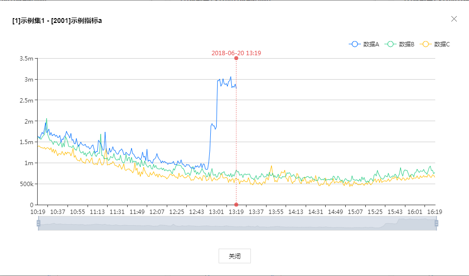
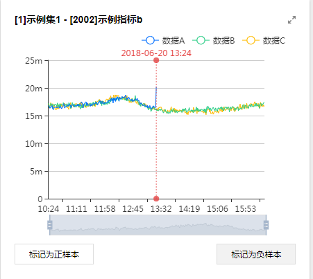
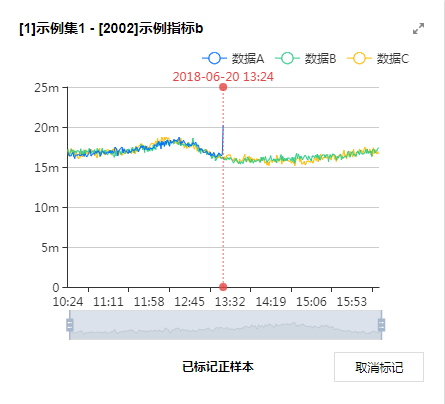
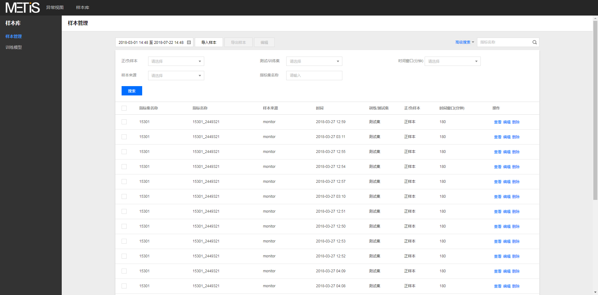
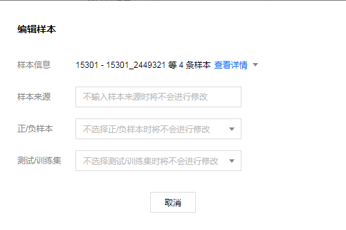
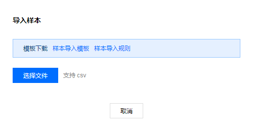
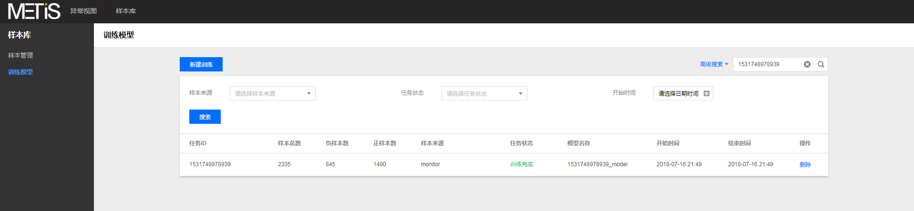
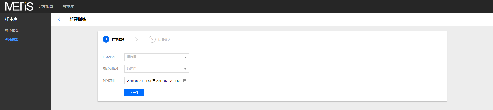
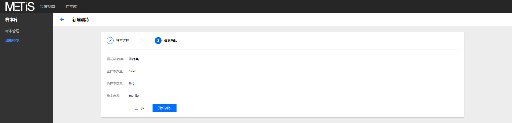

## Web Management Portal Use Guide

Introduce the instructions of the web management terminal, mainly contains the instructions for the use of functions such as abnormal queries, labeling, sample library management, and training models

## abnormal query

Entrance: `Odoma-abnormal query` can query the detection results of the result information information

1. Support time, index set, indicator dimension joint query

2. Support curve interaction: View big picture, narrowing, curve selection, etc.

######

Entrance: `Odxes-exceeded query` can be marked with the detection results.ked with the detection results.

1. Support sample labeling, mark as positive sample or negative sample

2. Support the cancellation labeling

## sample library

Entrance: `Sample library-sample management` can be added, deleted, deletion, modification, etc. of the sample data

1. Support time, sample source, window, classification set and other dimensions joint inquiries

2. Support single samples to view, edit, delete operations

3. Support batch editing and export operations

4. Support import sample operation

## training model

Entrance: `Sample library-training model` can be trained by detecting the model according to the sample data. The training model can be used for abnormal detection

1. Support time, sample source, task status and other dimensions joint inquiries

2. Support delete task records

3. Support new training tasks

